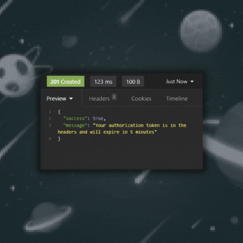
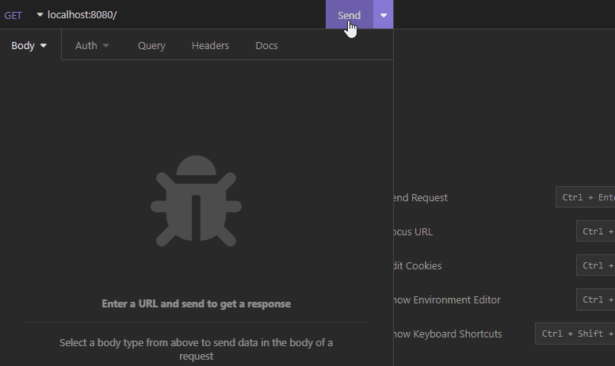
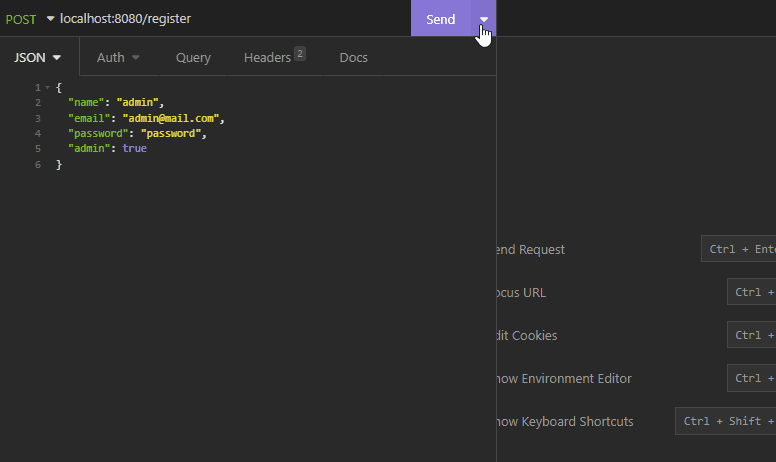
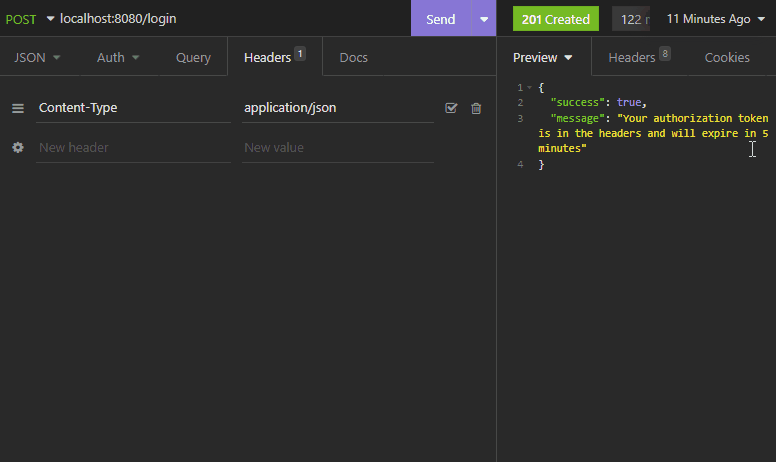
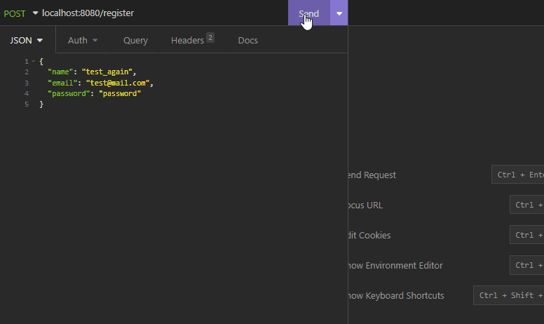

<h1 align="center">Login API</h1>
<div align="center">
    
    
    
    <a href="https://twitter.com/luisf_csdev/status/1595946611150303232" target="_blank" rel="noreferrer noopener">
        
    </a>
</div>
<p align="center">👾 Backend API REST for Express version of the Login JWT project 🔙</p>

<h4 align="center">
    <a href="#-features">Features</a> •
    <a href="#try-it-yourself">API Demo</a> •
    <a href="#-prerequisites">Prerequisites</a> •
    <a href="#-clone-repository">Clone Repository</a> •
    <a href="#-routes">Routes</a> •
    <a href="#-json">JSON</a> •
    <a href="#-stacks">Stacks</a> •
    <a href="#excelsior-code--by-luís-felipe">Author</a>
</h4>
<br>

## 📌 Features
- [x] Reusable login API REST
- [x] Express version of [Login JWT](https://github.com/luisf-csdev/login-jwt)
- [x] Unique emails register
- [x] Encrypted passwords with bcrypt
- [x] User validated by a token with expiration time
- [x] Admin-only route also validated by token
- [x] Provided data validated before being entered into the database
<br>

## [👾TRY IT YOURSELF👾](https://login-api-express.fly.dev/)
<div align="center">
    <br>
    
    <br>
    
    

</div>

## 
<br>

## 💾 Prerequisites
You'll need to have a database inside a project on the MongoDB Cloud and connect to obtain the Mongo URI:
- [MongoDB Cloud](https://cloud.mongodb.com/)

Then you'll need to have the following tools installed on your machine:
- [GIT](https://git-scm.com/)
- [Node.js](https://nodejs.org/)

Also, use your preferred code editor and REST client.
<br>

## 🪢 Clone Repository
```bash
# execute the git clone command
git clone https://github.com/luisf-csdev/login-jwt.git

# enter the project folder
cd login-api

# install the dependencies
npm install

# create a .env file in the directory's root with the mongo uri and the secret for your token
MONGODB_URI = your mongodb uri
TOKEN_SECRET = "any set of letters and numbers"

# finally, run the nodemon script
npm run nodemon

# the api will start in port:8080 - access <http://localhost:8080> in your rest client
```
<br>

## 🛣 Routes
### POST
- /login
- /register
### GET
- /user
- /user/admin
<br>

## ✨ JSON
### REGISTER
```JSON
{
"name": "(required)",
"email": "(required)",
"password": "(required)",
"admin": "(false by default)"
}
```
### LOGIN
```JSON
{
"email": "(required)",
"password": "(required)",
}
```
<br>

## 💽 Stacks
<span>
    
        <a href='https://www.javascript.com/'>JavaScript</a>
    
        <a href='https://nodejs.org/'>Node.js</a>
    
        <a href='https://expressjs.com/'>Express</a>
    
    <a href='https://www.mongodb.com/'>MongoDB</a>
     
        <a href='https://jwt.io/'>JSON Web Tokens</a>
     
        <a href='https://www.docker.com/'>Docker</a>
    
</span><br><br><br>

<hr>
<div align="center">
<h4>Excelsior code 💙 by Luís Felipe</h4>
 
[🪐 See my LinkedIn 🪐](https://www.linkedin.com/in/luisf-csdev/)
</div>
